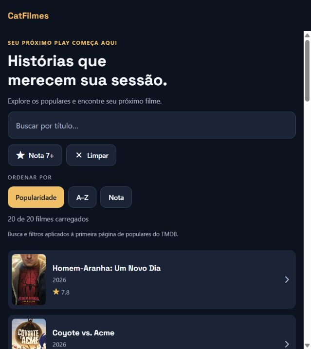
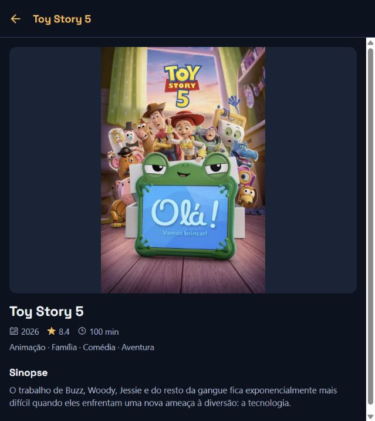
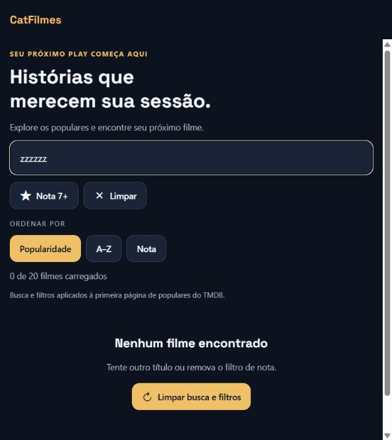

# CatFilmes

**Seu próximo play começa aqui.** Aplicativo React Native + Expo para explorar filmes populares do TMDB, buscar títulos na lista carregada e consultar pôster, ano, nota, duração, gêneros e sinopse.

Integrantes: Mateus Dantas de Morais, Guilherme Lavigne Aguiar Brito e Alisson Silva Nascimento.

## Entrega pós-MVP

- Identidade própria: fundo azul-noturno, destaques âmbar e títulos em Space Grotesk Bold.
- Categoria implementada: **descoberta**, com busca que ignora acentos e maiúsculas, filtro de nota 7+ e ordenação por popularidade, título ou nota.
- Busca e filtros combináveis, contagem de resultados, limpeza de filtros e preservação do estado ao voltar dos detalhes.
- Estados de carregamento, falha com nova tentativa, catálogo vazio, busca sem resultados e dados incompletos.
- 12 testes automatizados aprovados: 6 originais do MVP e 6 de descoberta.
- Build web de produção gerado e conferido no navegador em 18/09/2026.

**Limite intencional:** a descoberta opera na primeira página de populares retornada pelo TMDB (20 filmes na validação). Não é uma busca em todo o catálogo. A interface informa esse limite. Os filtros ficam na sessão; não há conta, favoritos nem sincronização.

## Identidade visual

| Papel | Cor |
|---|---|
| Fundo | `#0B1220` |
| Superfície de cards e campos | `#172338` |
| Bordas | `#30415B` |
| Destaque e ações | `#FFBE55` |
| Texto principal | `#F5F7FC` |
| Texto secundário | `#ACBBD0` |

A paleta remete à sala de cinema escura e à luz da projeção. **Space Grotesk 700** destaca títulos e cabeçalhos; a fonte nativa do sistema mantém textos longos legíveis. A fonte é empacotada, sem carregamento de um CDN durante o uso.

O ícone autoral reúne a letra **C** e o símbolo de **play**. Ícone principal, ícone adaptativo/monocromático Android, favicon e imagem da splash usam a mesma marca. Os arquivos substituem as imagens do template. A splash nativa está configurada via `expo-splash-screen`, aguardando o carregamento da fonte. Sua aparência em instalação nativa ainda precisa ser conferida em um build Android/iOS; o build web não valida a splash nativa.


Cores e fonte são centralizadas em `theme.js`; as telas reutilizam `Button`, `MovieCard`, `Loading` e `ErrorState`. Contêineres usam margem interna de 16 px e largura máxima de 760 px; cards e botões têm cantos de 12 px. Botões têm altura mínima de 44 px, feedback de pressão e destaque de seleção. A marca pode ser regenerada no Windows com `powershell -File scripts/generate-brand.ps1`.

## Como rodar

Pré-requisitos: Node.js compatível com o Expo SDK 57, npm e acesso à internet. Use preferencialmente Node 22.13+ ou 24 LTS. Para mobile, utilize uma versão do Expo Go compatível com o SDK ou um development build.

```sh
npm ci
```

Copie `.env.example` para `.env` e preencha:

```dotenv
EXPO_PUBLIC_TMDB_TOKEN=seu_api_read_access_token_do_tmdb
```

Obtenha o token em sua conta no [TMDB](https://www.themoviedb.org/settings/api). Não envie `.env` ao GitHub. Variáveis `EXPO_PUBLIC_*` são incorporadas ao bundle e **não são segredos protegidos no cliente**. Para distribuição pública, avaliar um backend intermediário e as condições de uso do TMDB.

```sh
npm start       # Expo
npm run web     # navegador em desenvolvimento
npm run android # Expo em Android disponível
npm run ios     # iOS disponível; simulador exige macOS
```

Sem token válido ou internet, o app apresenta mensagem de erro com nova tentativa.

## Testes e build de teste

```sh
npm test -- --runInBand
npm run build:web
node scripts/serve-build.cjs
```

Abra [http://127.0.0.1:4173](http://127.0.0.1:4173). O servidor usa **os arquivos exportados em `dist/`**, sem Metro e sem modo de desenvolvimento. Encerre com Ctrl+C. `dist/` é regenerável e está no `.gitignore`; o bundle local contém o token usado no build e não deve ser publicado indiscriminadamente.

O build de teste entregue nesta etapa é **web**, não um APK. Não foi executado EAS Build nem gerado APK/IPA. Ainda falta configurar o projeto/conta EAS e validar o app instalado em aparelho para uma entrega nativa. Se a disciplina exigir especificamente APK/preview Expo, essa parte permanece pendente.

Veja [VALIDACAO.md](docs/VALIDACAO.md) para os resultados e limites da verificação. Os 6 testes originais foram mantidos sem alterações. A nova suíte cobre busca com acentos, combinação de filtros, limite da nota, ordenação sem mutar a lista e estados vazios.

## Prints reais do build web

Capturas em 18/09/2026, com dados reais do TMDB; o catálogo pode mudar.

| Listagem | Detalhes | Busca vazia |
|---|---|---|
|  |  |  |

## Decisões e organização

Escolhemos descoberta porque ajuda a decidir o que assistir e reaproveita a API existente, sem backend novo, dados pessoais ou permissões adicionais. A funcionalidade é real, executada localmente sobre os dados recebidos. Login/cadastro, notificações, monetização e personalização com sincronização ficaram para depois: exigem, respectivamente, gestão de contas, um gatilho útil, definição de oferta e persistência de dados do usuário.

Mantivemos React Navigation para navegação, Axios para HTTP e Ionicons para ícones. Nesta etapa foram adicionados `@expo-google-fonts/space-grotesk` e `expo-splash-screen`. O lockfile registra as versões efetivamente instaladas.

```text
App.js                    providers, fontes, splash e navegação
app.json                  nome, ícones e configuração Expo
screens/                  HomeScreen e DetailsScreen
components/               Button, MovieCard, Loading e ErrorState
services/api.js           cliente TMDB
services/moviesService.js formatação e consultas de filmes
services/discovery.js     busca, filtro e ordenação locais
theme.js                  cores, fonte e espaçamentos
assets/                   marca do app
scripts/                  geração da marca e servidor do build
__tests__/                testes do MVP e de descoberta
docs/                     capturas, validação e roteiro de revisão
```

A limpeza removeu `.gitkeep` de pastas já preenchidas e o fundo Android do template, centralizou cores repetidas e eliminou variáveis de erro não usadas. Documentos das etapas anteriores foram preservados como histórico.

## Revisão cruzada e próximos passos

**Revisão cruzada com outro grupo: pendente.** A inspeção técnica no navegador não substitui essa atividade. O [roteiro e formulário](docs/REVISAO-CRUZADA.md) estão prontos para registrar participante, data, problemas e ajustes reais.

Próximas versões: busca remota com paginação, favoritos locais e depois sincronização autenticada, testes de interação em mobile e build nativo. Nenhuma dessas funções é apresentada como já implementada.

## Documentos da entrega

- [15 perguntas e respostas pós-MVP](RESPOSTAS-POS-MVP.md)
- [Validação desta etapa](docs/VALIDACAO.md)
- [Revisão cruzada — preencher após execução](docs/REVISAO-CRUZADA.md)
- [Respostas do MVP](RESPOSTAS-MVP.md)
- [Respostas da etapa inicial](RESPOSTAS.md)

Dados e imagens: TMDB. Este produto usa a API do TMDB, mas não é endossado nem certificado pelo TMDB.
